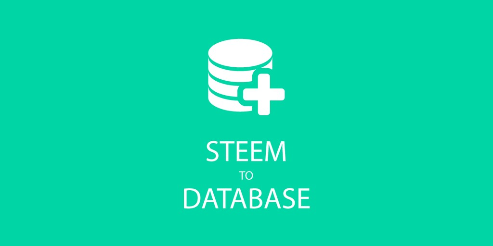
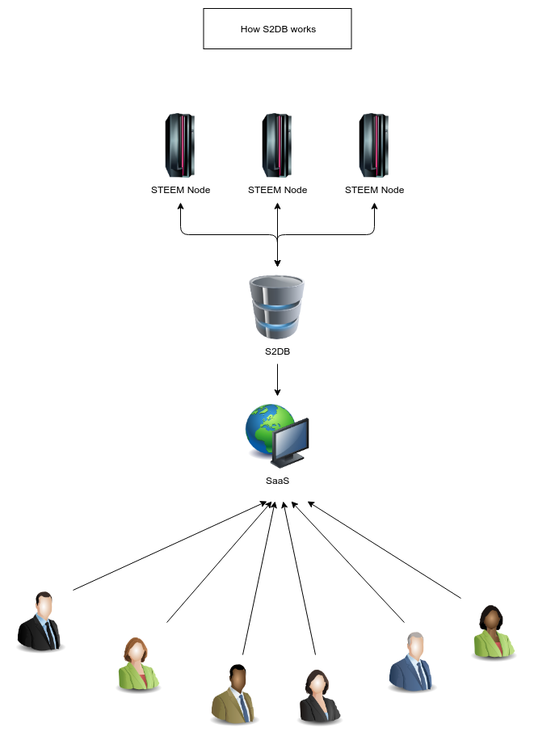

STEEM to Database
======



Description
------

The STEEM to Database will parse the STEEM Blockchain and insert the data into a Database. 
It is possible to parse either a single block, a range of blocks or run a continuous loop to parse all available blocks.

*Currently only MySQL is supported* 

Features
------

* [x] Parse a single block
* [x] Parse a range of Blocks
* [ ] Verify the Database (Check all blocks and insert missing data)
* [x] Parse latest blocks
* [ ] Highly configurable
* [x] Easily readable output

Installation
------

### Needles

```
php-mbstring
php-mysql
```

### Manually

**Step 1** Clone the repository
```
git clone git@dev.quiqqer.com:pcsg/steem-blockchain-parser.git
```

**Step 2** Edit the config file
```
mv etc/config.ini.php.dist etc/config.ini.php
nano etc/config.ini.php
```

**Step 3** Create Database
* Create da Database
* Import the SQL File `sql/createTables.sql`

**Step 4** Run composer
```
composer install
```

**Step 5** Run the parser
```
php run.php
```

### Docker

**Step 1** Database
Create a database on a database server (your docker containers must be able to connect to it)
Execute the `sql/createTables.sql` SQL-Queries to create the databases table structure


**Step 2** Docker container
We provide a docker container for ease of use.  
Change the environment variables and run the following command to get the container up and running.  
```
docker run --name steemit-parser \
  -e DB_HOST=<changeme> \
  -e DB_PORT=<changeme> \
  -e DB_USER=<changeme> \
  -e DB_PASSWORD=<changeme> \
  -e DB_NAME=<changeme> \
  --restart=unless-stopped \
  bogner/steem-blockchain-parser
```
 
**Hint**: To run the container in the background you need to add the `-d` flag to the `docker run` command.

Additional steps
------

### Keep the parser running

#### Supervisor

```
apt-get install supervisor
```

```
nano /etc/supervisor/conf.d/steem-blockchain-parser.conf
mkdir <parser-directory>/logs/
```

```
[program:blockchain-parser]
command=/usr/bin/php run.php
process_name = %(program_name)s-80%(process_num)02d
stdout_logfile = <parser-directory>/logs/blockchain-parser%(process_num)02d.log
stdout_logfile_maxbytes=100MB
stdout_logfile_backups=10
stderr_logfile= /home/s2db/logs/error-blockchain-parser%(process_num)02d.log
numprocs=1
directory=<parser-directory>
stopwaitsecs=10
user=<user>
autostart=true
autorestart=true
```

```
service supervisor restart
```


How it works
-----


